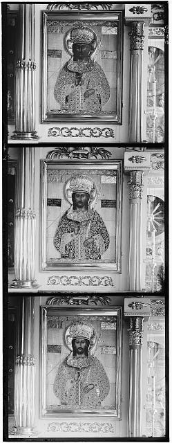
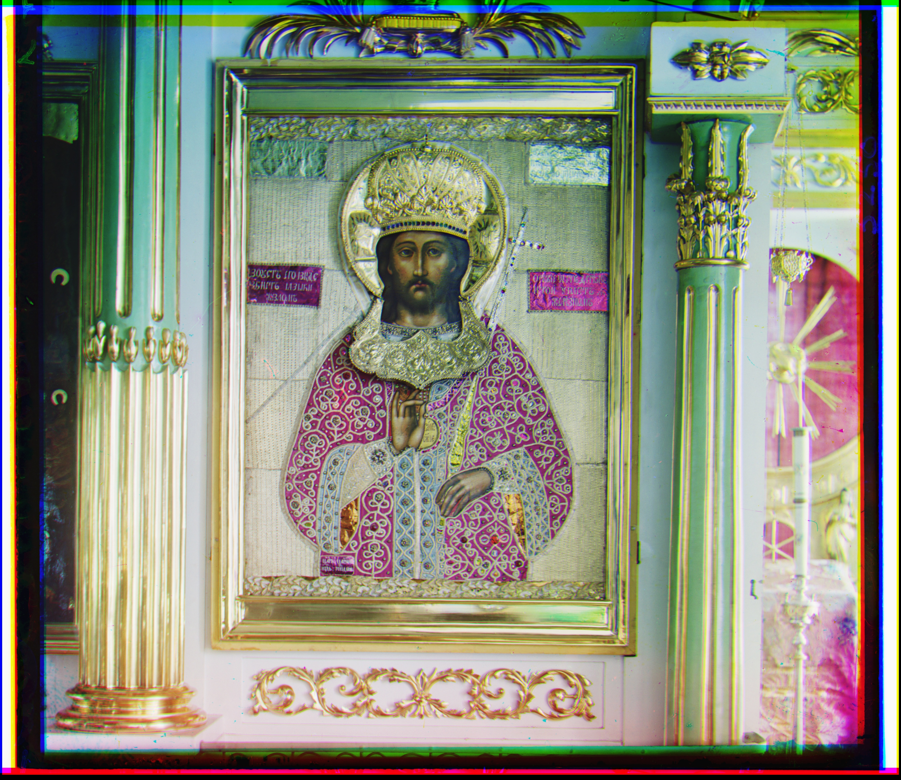

# Giving colour to the Prokudin-Gorskii photography collection
This project tries to give colour to some images from the Prokudin-Gorskii collection. The original samples taken
from the collection are sets of three images, each one represents one channel from the RGB colorspace.

<p align="center">
  
  
</p>

## Procedure
The project can be executed in 5 modes:
```python
working_image = 2 # Set working image
mode = "phase"    # "fft", "phase", "norm", "edges", None=(Space Convolution)
```
* Calculating the **Correlation** between the Fast Fourier Transforms from the images channels
* Calculating the **Phase Correlation** between the Fast Fourier Transforms from the images channels
* Calculating the **Normalized Correlation** between the image channels
* Calculating the **Correlation** between the Fast Fourier Transforms from the edges images channels
* Calculating the **Correlation** between the image channels

## Usage
The program gets the working image from the **img/** directory and the results are saved in the **results** folder.

To execute the project just run the prokudin-gorskii-colour.py file with a Python 3 version.

You can get the images samples from the collection here: [Prokudin-Gorskii Photography Collection](https://www.loc.gov/exhibits/empire/gorskii.html)
